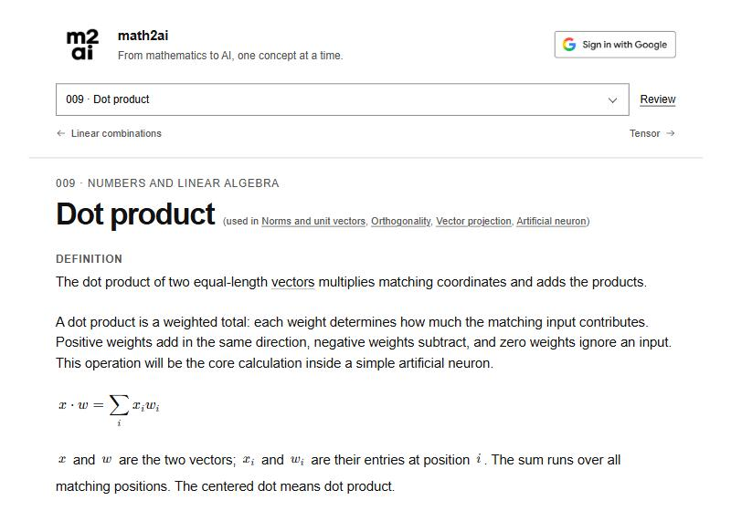
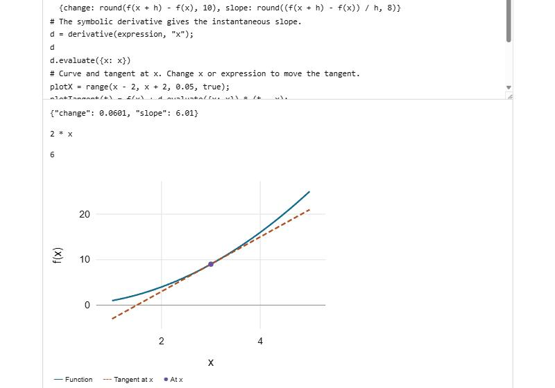
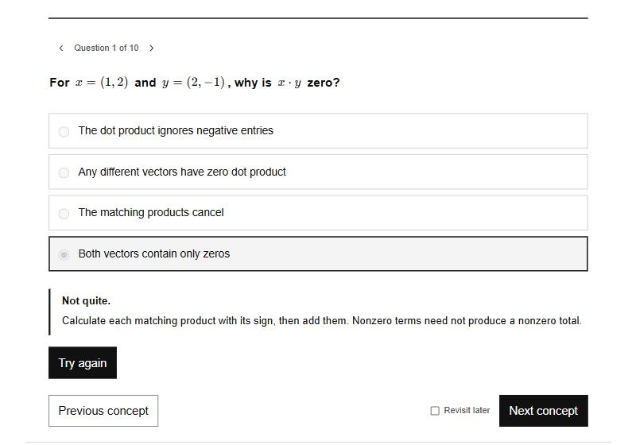

# math2ai

**The mathematics behind AI, one small idea at a time.**

[**Start learning at math2ai.github.io →**](https://math2ai.github.io/)

Free. No sign-up and nothing to install.

[](https://math2ai.github.io/)

math2ai is a course of 139 short lessons. It starts with a single number and builds, step by step, to how a large language model works.

It is for curious people who use AI and want to know what is going on inside it. You need school arithmetic and some patience with symbols. Each lesson explains the symbols it uses.

## What a lesson looks like

- **One idea per page.** A plain definition, the formula, and what each symbol in it means.
- **A worked example with small numbers.** A dot product, for instance, is a shopping bill: quantities times prices, added up.
- **A metaphor** to hold on to.
- **Code you can change.** 46 lessons include a small code box. Edit a number and the result updates, plots included.
- **Ten questions.** A first wrong answer gets a hint, not the answer, and a second try.
- **Links between ideas.** Each lesson links back to what it builds on and forward to where it is used.

| Change the code and watch the result | A wrong answer gets a hint first |
| --- | --- |
|  |  |

## The path

| Lessons | Chapter | What it builds |
| --- | --- | --- |
| 1–25 | Numbers and linear algebra | Numbers, vectors, matrices, transformations, eigenvectors |
| 26–42 | Probability and calculus | Uncertainty, limits, derivatives, optimization |
| 43–61 | Learning from data | Prediction, validation, trees, overfitting, causality |
| 62–88 | Neural networks and representations | Neurons, backpropagation, embeddings, compression, diffusion |
| 89–101 | Language models | Attention, Transformers, fine-tuning, retrieval, tools |
| 102–115 | Reinforcement learning and control | Rewards, policies, values, planning |
| 116–125 | Computing hardware | CPUs, GPUs, memory, clusters |
| 126–139 | Applied AI: mineral resource extraction | One field worked through, from raw measurements to a grounded answer |

Follow the lessons in order, or jump to any of them from the menu. **Review** lets you pick topics and brings back the questions you missed.

## Where did you get stuck?

The course is young, and reports from learners are how it gets better. If you try even a few lessons, the most useful thing you can send is the exact place you got lost:

- the lesson or question,
- the sentence, symbol or step that stopped you,
- what you expected instead.

A report like "this lesson uses a word it never explained" leads directly to a fix. Mistakes in a question, unhelpful hints and ideas for missing lessons are just as welcome.

[**Send feedback →**](https://github.com/math2ai/math2ai.github.io/issues/new?title=Feedback%3A%20&body=%2A%2ALesson%20or%20question%3A%2A%2A%0A%0A%2A%2AWhat%20stopped%20me%3A%2A%2A%0A%0A%2A%2AWhat%20I%20expected%20instead%3A%2A%2A%0A) (opens a GitHub issue; needs a free GitHub account)

## Good to know

- **Your progress** is saved in your browser. Signing in with Google is optional and syncs it across devices.
- **It works offline.** The whole course is one file, [`index.html`](index.html). Save it and open it in a browser; only the further-reading links need a connection.
- **Anonymous, public statistics.** The site counts visits, lesson views and answers without accounts, cookies or visitor IDs, and shows the totals to everyone on its [statistics page](https://math2ai.github.io/stats.html). Browsers that send Do Not Track are not counted, and neither are offline copies.
- **A checkmark is not mastery.** It means you answered one of a lesson's questions correctly. Use Review to come back to a topic later.
- **Scope.** The course is an educational synthesis with constructed numerical examples. Lessons link to Wikipedia and to primary papers, textbooks and documentation.
- **Print.** A [PDF](Mathematics-to-Model-Conversations.pdf) and an editable [PowerPoint](Mathematics-to-Model-Conversations.pptx) of the original 100-concept edition are included, one concept per page.

## For contributors

Lesson text, questions and the site code live in [`source/`](source/). Rebuilding needs Python 3 and Node.js 22 or newer, with no packages to install:

```sh
cd source
python build_content.py
python build_site.py
```

The [maintainer guide](source/README.md) covers how progress is saved, how lessons and questions are written, the checks to run before publishing, and the optional Google sign-in setup.

## License

The course text and site code are under the [MIT license](LICENSE). Vendored libraries keep their own licenses, listed in the [maintainer guide](source/README.md#license).
